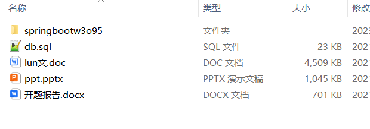
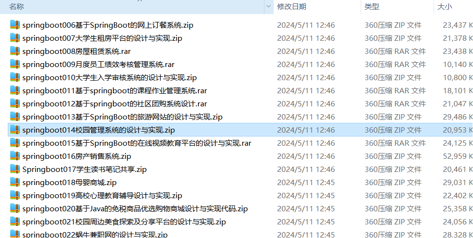
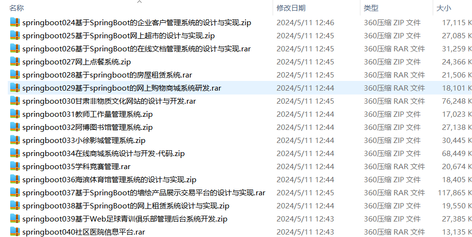
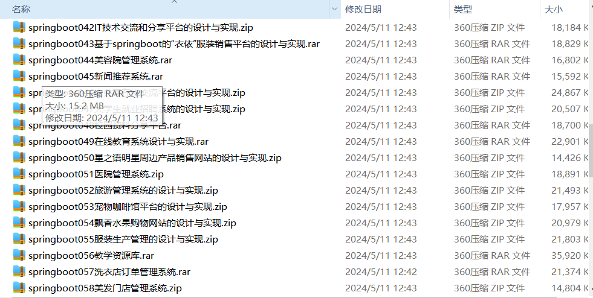
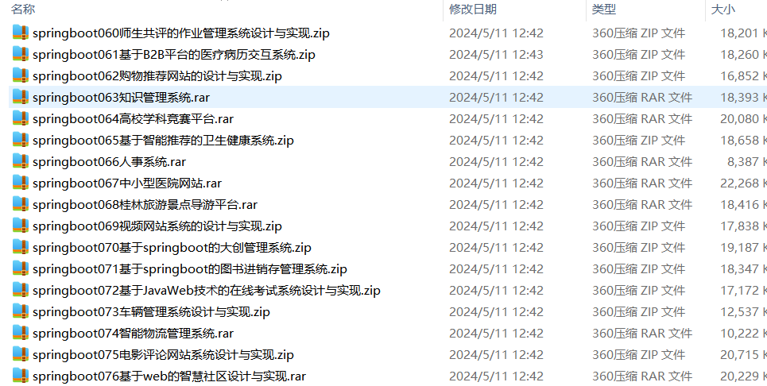
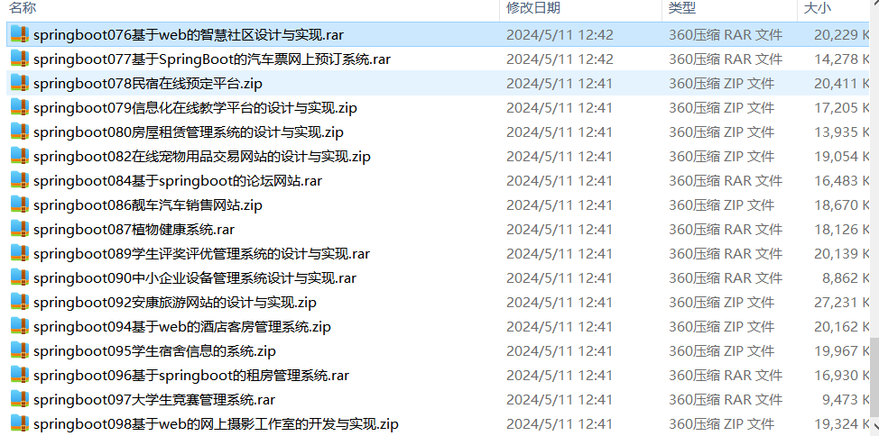

# springboot_vehicle_movie_competition_hotel_forum_bnb_bus_hr_photo_video_edu_exam_community_logistics_hospital
📦 **SpringBoot多功能项目仓库** 🎯

本仓库汇集了五个基于 **Spring Boot** 开发的高实用性项目，涵盖 **兼职招聘、客户管理、在线超市、美食分享、宿舍管理** 等多个领域，适用于学习、开发实践和功能拓展！🚀

🚗 **车辆管理系统** —— 车辆信息登记、维修记录、调度管理，助力企业高效管理车辆资源 🏎️🛠️

🎬 **电影评论网站系统** —— 电影资讯、用户影评、评分统计，打造互动式影迷交流平台 🍿⭐

🏆 **高校学科竞赛平台** —— 竞赛报名、赛事管理、成绩公示，提升高校学科竞赛的组织效率 📜🏅

🏨 **酒店客房管理系统** —— 客房预订、入住管理、订单结算，助力酒店运营数字化升级 🛏️🛎️

💬 **论坛网站** —— 帖子发布、评论互动、用户管理，提供开放式社交讨论平台 📝💡

🏡 **民宿在线预订平台** —— 房源管理、预订支付、评价系统，为个性化短租市场提供完整解决方案 🏠💳

🚌 **汽车票网上预订系统** —— 在线购票、车次查询、订单管理，优化客运行业的购票体验 🎟️🚏

👨‍💼 **人事系统** —— 员工信息管理、考勤记录、薪资核算，助力企业高效管理人力资源 📋💰

📷 **摄影工作室系统** —— 摄影套餐管理、客户预约、作品展示，助力摄影行业数字化运营 📸🎭

📺 **视频网站系统** —— 视频上传、播放、推荐，打造个性化在线视频平台 🎥📡

🎓 **信息化在线教学平台** —— 课程管理、在线授课、作业提交，推动教育行业信息化发展 📚💻

📝 **在线考试系统** —— 题库管理、自动判分、成绩分析，实现智能化考试管理 🏫📊

🏘️ **智慧社区系统** —— 物业服务、社区公告、住户互动，提升社区管理智能化水平 🏠📢

🚚 **智能物流管理系统** —— 订单追踪、仓储管理、配送调度，优化供应链物流管理 📦📍

🏥 **中小型医院网站** —— 患者信息管理、医生预约、在线问诊，提升医疗机构的信息化服务水平 💉🩺

所有项目均基于 **Spring Boot** 开发，结合 **MySQL、Redis、Vue.js** 等主流技术，具备良好的扩展性与实用性。欢迎 **Star & Fork**，一起交流学习！🚀

项目部署说明✨：

推荐使用：谷歌浏览器

后台地址😎
http://localhost:8080/springboot/admin/dist/index.html

管理员  abo 密码 abo

前台地址😎

http://localhost:8080/springboot/front/index.html

在src\main\resources\application.yml中编辑数据库配置🎉										
url: jdbc:mysql://127.0.0.1:3306/springboot?useUnicode=true&characterEncoding=utf-8&useJDBCCompliantTimezoneShift=true&useLegacyDatetimeCode=false&serverTimezone=UTC
username: root
password: 123456

文档预览👀

其他项目合集✨

